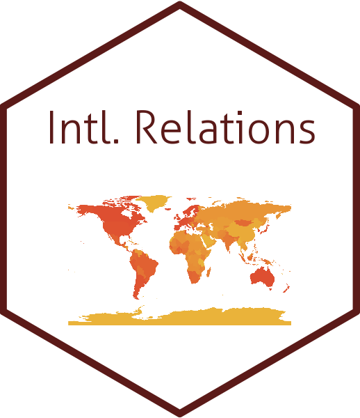

## Hello, welcome to my GitHub page ⚡

I am a Ph.D. Candidate in the Department of Political Science at the University of South Carolina, Columbia. I study Comparative Politics, International Relations, and Political Methodology. My research interests include some areas with an emphasis on the effects of political institutions across various geographies.

More specifically, my research examines how institutions condition individuals’ behavior and how these and other factors shape systematic change. Thus, I am focusing on some political features in dictatorships (autocracies) that are usually considered just “non-democracies.” I’m currently working on the research topics of *Why Do Authoritarian Regimes Provide Welfare?* and *Heterogeneous Democracy: Elite Politics and Elite Politics and Economic Sanctions*. If you want to know me more, feel free to visit my [webpage](https://www.sanghoon-park.com/) and see my latest curriculum vitae (also, you can find my CV [here](https://sanghoon-park.com/cv/cv_sanghoon_latest.pdf)

### Studies on Comparative Authoritarianism  
- 💬 Studies on comparative authoritarian regimes will be labeled with the sticker of **Comparative Autocracies**.
    
- Published Papers: 
  - [Empirical Indicators of Democracy and Authoritarianism](https://www.oxfordbibliographies.com/view/document/obo-9780199756223/obo-9780199756223-0348.xml?rskey=tdWYwB&result=1&q=Empirical+Indicators+of+Democracy+and+Authoritarianism#firstMatch) 
    - Co-author: [Matthew C. Wilson (UofSC)](http://matthewcharleswilson.com/), *peer-reviewed*
- Under Reviews:
  - You Scratch My Back and I Scratch Yours: An Explanation of Dyadic Politics of Naming and Shaming  
    - Co-author: Chun-Young Park (UGA)
- Working Papers: 
  - [Why do authoritarian regimes provide welfare programs?](https://github.com/pherephobia/Authoritarian.Welfare)
  - [Heterogeneous Democratization: Elite Politics and Economic Sanctions](https://github.com/pherephobia/HeteroDem)

### Studies on Korean Politics 
- 💬 Studies on Korean politics will be labeled with the sticker of **Korean Politics**.
    
- Published Papers
  - Multi-Member District and Survival of the Third Party: The Cases between the 4th and 8th Korean Local Elections
    - Co-author: Chae Hoon Lee (KETI)
  - Who Does Early Voting Serve?: A Study of Voters in Korea’s 20th Presidential Election
    - Co-author: Jaeyoung Hur (Yonsei Univ.)
  - [Leadership in Communication: How Leadership and Communication Affect Public Service Motivation (PSM)](https://github.com/pherephobia/05_KIPA-KAPA)
    - Co-authors: Jiyoon Kang (UofSC), Sun Gue Yang (UofSC)
  - [Effect of Reasons for Re/by-election on Voting Participation and Outcomes: An Empirical Study of Re/by-elections for the Korean National Assembly after democratization](https://github.com/pherephobia/03_KR_REBYELECTION_TURNOUT)
- Book chapter In *Issues and Perspectives in Korean Peace Process.* Hankuk University of Foreign Studies Knowledge Press.:
  - [What Do We Know and Do Not Know?: Attitudes Toward North Korea and Unification](https://github.com/pherephobia/2020_Panmunjom)
    - Co-author: Jaeyoung Hur (Yonsei Univ.)
- Working Papers: 
  - Trust Heuristic and Vote Choice: Evidence from Cross-sectional Studies in South Korea 
    -  Co-authors: Jaeyoung Hur (Yonsei Univ.), Hyun-Hee Heo (Korea Univ.), Deok Hyun Jang (Gallup Korea), Won Mo Jang (SNU Borame Medical Center)
- Data sets:
  - Republic of Korea National Election Commission archives and provides data on political parties and elections in South Korea. However, it provides data in the format of an interactive webpage, which is not suitable to investigate for research.
  - Using `{RSelenium}`, I scrapped the tables and manipulated them into tidy forms.
  - Local Election
    - List of the elected and candidates
      - District-level
        - [City-municipal councils(시군구의회)](https://github.com/pherephobia/electoral_archive/blob/main/%E1%84%8C%E1%85%B5%E1%84%87%E1%85%A1%E1%86%BC%E1%84%89%E1%85%A5%E1%86%AB%E1%84%80%E1%85%A5%20%E1%84%80%E1%85%B5%E1%84%8E%E1%85%A9%E1%84%8B%E1%85%B4%E1%84%92%E1%85%AC%20%E1%84%8C%E1%85%B5%E1%84%8B%E1%85%A7%E1%86%A8%E1%84%80%E1%85%AE(06-22).csv)
    - Vote shares
      - [City-province councils(시도의회)](https://github.com/pherephobia/electoral_archive/blob/main/%E1%84%89%E1%85%B5%E1%84%83%E1%85%A9%E1%84%8B%E1%85%B4%E1%84%92%E1%85%AC%E1%84%89%E1%85%A5%E1%86%AB%E1%84%80%E1%85%A5.xlsx)
      - [City-province leaders(시도지사)](https://github.com/pherephobia/electoral_archive/blob/main/%E1%84%89%E1%85%B5%E1%84%83%E1%85%A9%E1%84%8C%E1%85%B5%E1%84%89%E1%85%A1%E1%84%89%E1%85%A5%E1%86%AB%E1%84%80%E1%85%A5.xlsx)
      - [City-municipal councils(시군구의회)](https://github.com/pherephobia/electoral_archive/blob/main/%E1%84%89%E1%85%B5%E1%84%80%E1%85%AE%E1%86%AB%E1%84%80%E1%85%AE%E1%84%8B%E1%85%B4%E1%84%92%E1%85%AC%E1%84%89%E1%85%A5%E1%86%AB%E1%84%80%E1%85%A5.xlsx)
      - [City-municipal leaders(시군구의장)](https://github.com/pherephobia/electoral_archive/blob/main/%E1%84%89%E1%85%B5%E1%84%80%E1%85%AE%E1%86%AB%E1%84%80%E1%85%AE%E1%84%8B%E1%85%B4%E1%84%8C%E1%85%A1%E1%86%BC%E1%84%89%E1%85%A5%E1%86%AB%E1%84%80%E1%85%A5.xlsx)

### Studies on International Relations
- 💬 Studies on International Relations will be labelled with the sticker of **Intl. Relations**.
    
- Published Papers: 
  - [Expanding China’s Influence via Membership: Examining the Influence of Chinese-Led International Institutions on Responses to Human Rights Issues in China](https://link.springer.com/article/10.1007/s11366-024-09886-2)
    - Co-author: Hyunkyu Kim (Hankuk Univ. of Foreign Studies)
- Working Papers:
  - [Social Capital and the Success of Economic Sanction](https://github.com/pherephobia/SCEconSanction)
    - Co-authors: Jaeyoung Hur (Yonsei Univ.), [Hanna Kim (UNOmaha)](https://www.unomaha.edu/college-of-arts-and-sciences/political-science/about-us/directory/hannah-june-kim.php), [Taehee Whang (Yonsei Univ.)](https://yonsei.pure.elsevier.com/en/persons/taehee-whang)

### Studies on Pedagogy
- 💬 Studies on pedagogy and education on ppolitical science will be labelled with the sticker of **Pedagogy**.
    
- Published Papers: 
  - [Concept Mapping and Reading Comprehension](https://www.tandfonline.com/doi/abs/10.1080/15512169.2023.2164861?journalCode=upse20)
    - Co-authors: [Matthew C. Wilson (UofSC)](http://matthewcharleswilson.com/), [Christopher Howell (UofSC)](https://sites.google.com/view/c-e-howell), and [Kelsey Martin-Morales (UofSC)](https://www.kelseymartinmorales.com/)

 ### Languages
  

### Contacts
 

<!--
**pherephobia/pherephobia** is a ✨ _special_ ✨ repository because its `README.md` (this file) appears on your GitHub profile.

Here are some ideas to get you started:

- 🔭 I’m currently working on ...
- 🌱 I’m currently learning ...
- 👯 I’m looking to collaborate on ...
- 🤔 I’m looking for help with ...
- 💬 Ask me about ...
- 📫 How to reach me: ...
- 😄 Pronouns: ...
- ⚡ Fun fact: ...
-->
