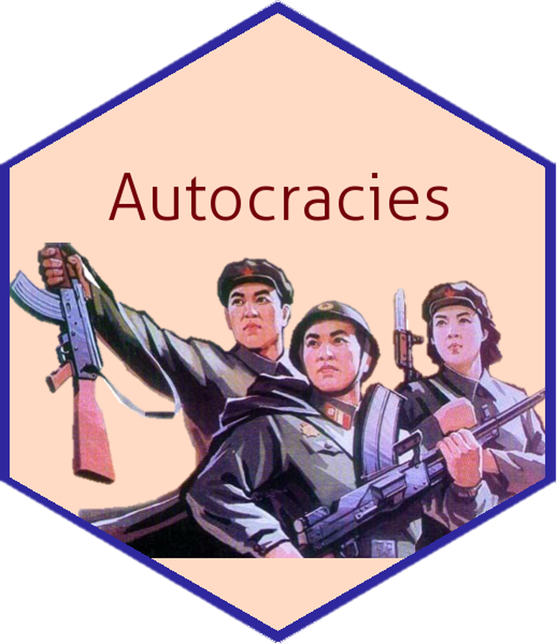

## Hello, welcome to my GitHub page ⚡

I am a Ph.D. student in the Department of Political Science at the University of South Carolina, Columbia. I study Comparative Politics, International Relations, and Political Methodology. My research interests include some areas with an emphasis on the effects of political institutions across various geographies.

More specifically, my research examines how institutions condition individuals’ behavior and how these and other factors shape systematic change. Thus, I am focusing on some politics features in dictatorships (autocracies) that are usually considered just “non-democracies.” I’m currently working on the research topics of *Why Do Authoritarian Regimes Provide Welfare?* and *Heterogeneous Democracy: Elite Politics and Elite Politics and Economic Sanctions*. If you want to know me more, feel free to visit my [webpage](shpark.netlify.app) and see my lastest curriculum vitae!

### Comparative Authoritarian Studies     

- 💬 Studies on comparative authoritarian regimes will be labelled with the sticker of **Comparative Autocracies**.

### Studies on Korean Politics     

- 💬 Studies on Korean politics will be labelled with the sticker of **Korean Politics**.

<!--
**pherephobia/pherephobia** is a ✨ _special_ ✨ repository because its `README.md` (this file) appears on your GitHub profile.

Here are some ideas to get you started:

- 🔭 I’m currently working on ...
- 🌱 I’m currently learning ...
- 👯 I’m looking to collaborate on ...
- 🤔 I’m looking for help with ...
- 💬 Ask me about ...
- 📫 How to reach me: ...
- 😄 Pronouns: ...
- ⚡ Fun fact: ...
-->
